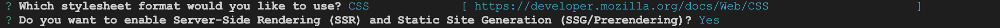
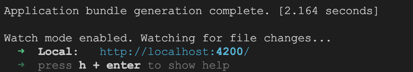

# Angular Setup And CLI Lab

## 1. Create Angular project 

### 1.1 Using Angular CLI create a new Angular Project

1. Open terminal window and go to location where you want to create your Angular project:

    ```.sh
    cd /projects
    ```

2. Run the following command to create a new Angular project called `calab`:

    ```.sh
    npx -p @angular/cli ng new calab
    ```
3. You will be propted with following:
    []() 

    - Type `y`

4. You will be asked this also:
    []() 
    
    - Select `CSS`
        
5. Finally, you will be asked this:
    []() 

    - Type `y`

### 1.2 Start Angular Development Server

1. Change crrent directory in your terminal to newly created Angular project.

    ```.sh
    cd calab
    ```
2. Type the following command to start the Angular Project.

    ```.sh
    npx -p @angular/cli ng serve
    ```
3. When Starting Angular Development serverver for the first time, you will be asked the following question:
    []() 
    - Type `y` or `n`

4. You should see a message in your Terminal confirming the development server has successfully started:
    []() 

5. Click on a link in the confirmation message above. You should see the following in your newly opened browser window:
    []() 
