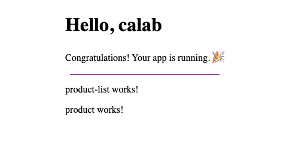

# Create a New Angular Component

## 1. Setup Project

### 1.1 Install Dependencies

1. Change directory to `calab`:

    ```.sh
    cd calab
    ```
2. Install dependencies by running the following command:

    ```.sh
    npm install
    ```
3. You should see a message in your Terminal confirming the npm packages were installed successfully:
    []() 

## 2. Create Components

### 2.1 Create Product Component
1. Create a new component called `Product` using CLI:

    ```.sh
    npx -p @angular/cli ng generate component components/product
    ```

### 2.2 Create ProductList Component

1. Create a new component called `ProductList` using CLI:

    ```.sh
    npx -p @angular/cli ng generate component components/product-list
    ```

### 2.3 Import ProductComponent 

1. Import `ProductComponent` into `src/app/components/product-list/product-list.component.ts`:

    ```.js
    import { ProductComponent } from '../product/product.component';
    ```
2. Inside `src/app/components/product-list/product-list.component.ts` update `imports` to include `ProductComponent`:

    ```.js
    imports: [ProductComponent],
    ```
3. Open `src/app/components/product-list/product-list.component.html` template and add the following element:

    ```.html
    <app-product></app-product>
    ```

### 2.4 Import ProductListComponent 

1. Import `ProductListComponent` into `src/app/app.component.ts`:

    ```.js
    import { ProductListComponent } from './components/product-list/product-list.component';
    ```

2. Inside `src/app/app.component.ts` update `imports` to include `ProductListComponent`:

    ```.js
    imports: [RouterOutlet, ProductListComponent],
    ```
3. Open `src/app/app.component.html` template and add the following element after the `<div class="divider"...`

    ```.html
    <app-product-list></app-product-list>
    ```

### 2.5 Start The Application

1. Start Angular Development Server if not yet started:

    ```.bash
    npx -p @angular/cli ng serve
    ```
    > _Otherwise refresh the browser tab to see updated view._

2. You should see the following getting rendered in your browser:

    []() 


## 3. Create Product Model

### 3.1 Create new Folder and Class
- Inide `src/app/` create a new filder called `models`:
- Inide `src/app/models` create a new file called `product.ts`
- Open `src/app/models/product.ts` and add the following code:

    ```.js
    export class Product {
        constructor(
            public name: string,
            public price: number,
        ) {}
    }
    ```
 

## 4. Create Parent Child Communication between Components

### 4.1 Modify ProductListComponent
1. Open `src/app/components/product-list/product-list.component.ts` file and inside `ProductListComponent` class do the following:
    - Import `Product` model:

        ```.js
        import { Product } from '../../models/product';
        ```
    - Declare an emty cart list:

        ```.js
        cart: Product[] = [];
        ```

     - Declare a Product:

        ```.js
        product = new Product('Product A',  10.99);
        ```
    

    - Create a method called `addToCart()` that is takes product as a parameter and pushes that product to the cart:

        ```.js
        addToCart(product: Product) {
            this.cart.push(product);
        }
        ```
2. Open `src/app/components/product-list/product-list.component.html` file and do the following:
    - Display cart list length. Just before `<app-product>` add the following:
    
        ```.html
        Cart:{{cart.length}}
        ```

### 4.2 Modify ProductComponent
1. Open `src/app/components/product/product.component.ts` file and inside `ProductComponent` class do the following:
    - Import `Input`, `Output`, `EventEmitter` and `Product`:

        ```.js
        import { Component, EventEmitter, Input, Output } from '@angular/core';
        import { Product } from '../../models/product';     
        ```
    - Declare a product Input() that is passed from parent component:
    
        ```.js
        @Input() product!: Product;
        ```
    
    - Declare `addToCartEvent` event emmiter to emit event to parent component:

        ```.js
        @Output() addToCartEvent = new EventEmitter<Product>();
        ```

    - Create a method called `onAddToCartClicked()` will emit a product to the `addToCartEvent` emmiter:

        ```.js
        onAddToCartClicked(){
            this.addToCartEvent.emit(this.product);
        }
        ```
2. Open `src/app/components/product/product.component.html` file and do the following:
    - Replace `<p>product works!</p>` with the following:
    
        ```.html
        <div>
            <h2>{{ product.name }}</h2>
            <p>Price: {{ product.price }}</p>
            <button (click)="onAddToCartClicked()">Add to Cart</button>
        </div>
        ```

### 4.3 Pass Data to and from child component
1. Open `src/app/components/product-list/product-list.component.html` file and do the following:
    - Pass product that we declared earlier to the `ProductComponent`:

        ```.html
        <app-product [product]="product"></app-product>
        ```

    -  Bind output property and function that were declared earlier:

        ```.html
        <app-product [product]="product"(addToCartEvent)="addToCart($event)"></app-product>
        ```


### 4.4 Instpect Changes

1. Start Angular Development Server if not yet started:

    ```.bash
    npx -p @angular/cli ng serve
    ```
    > _Otherwise refresh the browser tab to see updated view._

2. You should see the following getting rendered in your browser:

    []() 
    
    > _Clicking 'Add to Cart' button should increase Cart count._
