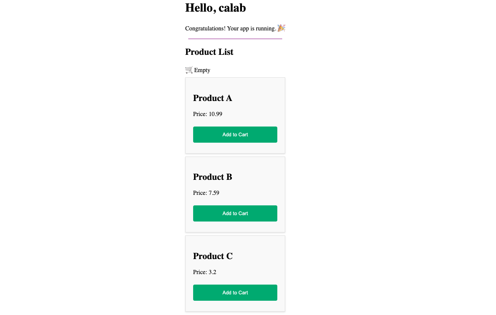
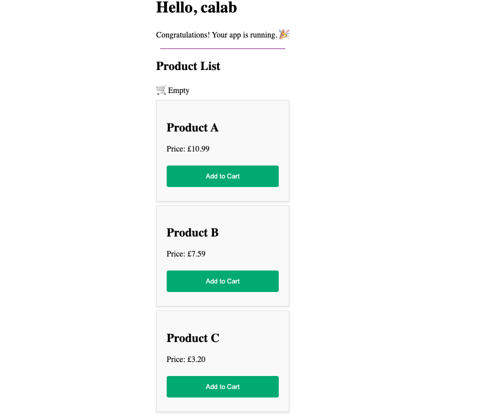
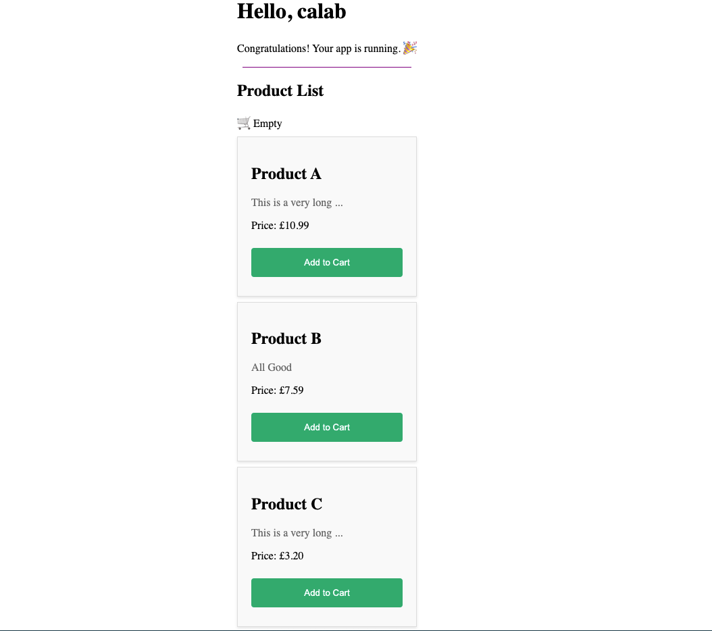

# Create Custom Pipe

## 1. Setup Project

### 1.1 Install Dependencies

1. Change directory to `calab`:

    ```.sh
    cd calab
    ```
2. Install dependencies by running the following command:

    ```.sh
    npm install
    ```
3. You should see a message in your Terminal confirming the npm packages were installed successfully:
    []() 

### 1.1 Start The Application

1. Start Angular Development Server if not yet started:

    ```.bash
    npx -p @angular/cli ng serve
    ```
    > _Otherwise refresh the browser tab to see updated view._

2. You should see the following getting rendered in your browser:

    []() 

    > _You should see similar view to where you left off in previous lab._

## 2. Use Built-in Pipe

### 2.1 Update Product Component To Use Built-in Corrency Pipe
1. Open `src/app/components/product/product.component.ts` file and do the following:
    - Import `CurrencyPipe` from `'@angular/common'`:

        ```.js
        import { CurrencyPipe } from '@angular/common';​
        ```
    - 2. Update `imports` to include `CurrencyPipe`:

        ```.js
          imports: [CurrencyPipe],
        ```
2. Open `src/app/components/product/product.component.html` file and do the following:
    - Update Paragraph element representing Price to include currency pipe:

        ```.html
        <p>Price: {{ product.price | currency: "GBP"}}</p>
        ```

### 2.2 Instpect Changes

1. Start Angular Development Server if not yet started:

    ```.bash
    npx -p @angular/cli ng serve
    ```
    > _Otherwise refresh the browser tab to see updated view._

2. You should see the following getting rendered in your browser:

    []() 


## 3. Create Custom Pipe

### 3.1 Update Product Model with description

- Open `src/app/models/product.ts` file and extend current implementation with new `description` property:

    ```.js
    export class Product {
        constructor(
            public name: string,
            public description: string,
            public price: number,
        ) {}
    }
    ```

### 3.2 Update Product List Component

- Open `src/app/components/product-list/product-list.component.ts` file and update current list of Products array. Add description to each instance of a Product:

    ```.js
    products: Product[] = [
        new Product('Product A', 'This is a very long text that needs to be truncated', 10.99), 
        new Product('Product B', 'All Good', 7.59), 
        new Product('Product C', 'This is a very long text that needs to be truncated ', 3.20)
    ];
    ```
### 3.3 Update Product Component

- Open `src/app/components/product/product.component.css` file and add a new CSS selector to style product details.

    ```.css
    .product-description {
        font-size: 16px;
        color: #666;
    }
    ```

- Open `src/app/components/product/product.component.html` file and add a new Paragraph just below the product `<h2>` title element:

    ```.html
    <p class="product-description">{{ product.description }}</p>
    ```

### 3.3 Generate Custom Pipe

- In your terminal window type in the following commad:

    ```.sh
    npx -p @angular/cli ng generate pipe pipes/truncate
    ```

- Open `src/app/pipes/truncate.pipe.ts` file and add the following implementation to newly created `truncate` pipe.
```.js
@Pipe({
  name: 'truncate',
  standalone: true
})
export class TruncatePipe implements PipeTransform {

  transform(value: string, maxLength: number = 20): string {
    if (value.length <= maxLength) {
      return value;
    }
    return value.substring(0, maxLength) + '...';
  }
}
```

### 3.4 Update Product Component To Use Custom Pipe

- Open `src/app/components/product/product.component.ts` file and do the following:
    - Import `TruncatePipe` from `'../../pipes/truncate.pipe'`

        ```.js
        import { TruncatePipe } from '../../pipes/truncate.pipe';
        ```
    - Update `imports` to include `TruncatePipe`:

        ```.js
        imports: [CurrencyPipe, TruncatePipe],
        ```

- Open `src/app/components/product/product.component.html` and update product paragraph to include the `truncate` pipe: 
    ```.html
    <p class="product-description">{{ product.description | truncate}}</p>
    ```

### 3.5 Instpect Changes

1. Start Angular Development Server if not yet started:

    ```.bash
    npx -p @angular/cli ng serve
    ```
    > _Otherwise refresh the browser tab to see updated view._

2. You should see the following getting rendered in your browser:

    []() 

    > _See how description is getting truncated._