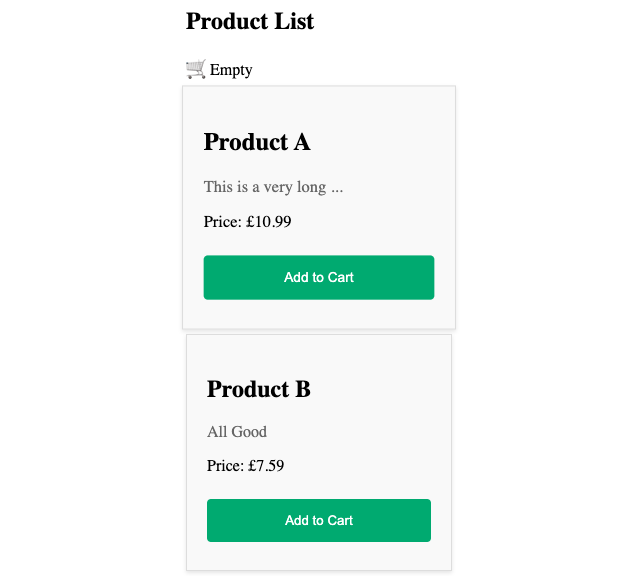
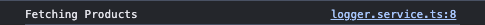

# Dependency Injection Lab

## 1. Setup Project

### 1.1 Install Dependencies

1. Change directory to `calab`:

    ```.sh
    cd calab
    ```
2. Install dependencies by running the following command:

    ```.sh
    npm install
    ```
3. You should see a message in your Terminal confirming the npm packages were installed successfully:
    []() 

### 1.1 Start The Application

1. Start Angular Development Server if not yet started:

    ```.bash
    npx -p @angular/cli ng serve
    ```
    > _Otherwise refresh the browser tab to see updated view._

2. You should see the following getting rendered in your browser:

    []() 

    > _You should see similar view to where you left off in previous lab._

## 2. Create A Service​

### 2.1 Create A Service To Return List Of Products

1. Create a new service called `ProductService` using CLI:

    ```.sh
    npx -p @angular/cli ng generate service services/product
    ```

2. Open `src/app/services/product.service.ts` file and add the following code:

    ```.js
    import { Injectable } from '@angular/core';
    import  DATA from './MOCK_DATA.json';

    @Injectable({
        providedIn: 'root'
    })
    export class ProductService {
        constructor() { }

        getProducts(){
            return DATA;
        }
    }
    ```
    > _getProducts() method will return the mock Data imported from MOCK_DATA.json._

## 3. Inject Service as Dependency Into Component


### 3.1 Update Product Model with id.
1. Open `src/app/models/product.ts` and update `Product` model with the follwoing:

    ```.js
    export class Product {
        constructor(
            public id: number,
            public name: string,
            public description: string,
            public price: number,
        ) {}
    }
    ```

### 3.2 Inject Product Service to Product List Component

1. Open `src/app/components/product-list/product-list.component.ts` file and do the following:
    - Import ProductService:

        ```.js
        import { ProductService } from '../../services/product.service';
        ```

    - Add the `ProductService` as a parameter into the  `constructor`.

        ```.js
         constructor(private productService: ProductService) {}
        ```
    - Replace static list of Products with a service call.

        ```.js
        products: Product[] = this.productService.getProducts();
        ```

### 3.3 Instpect Changes

1. Start Angular Development Server if not yet started:

    ```.bash
    npx -p @angular/cli ng serve
    ```
    > _Otherwise refresh the browser tab to see updated view._

2. You should see the following getting rendered in your browser:

    []() 


## 4. Injecting Services In Other Services 

### 4.1 Create A New Logger And Implement It's Logic

1. Create a new `Logger` using CLI:

    ```.sh
    npx -p @angular/cli ng generate service services/logger/logger 
    ```
2. Open `src/app/services/logger/logger.service.ts` file and do the following:
    - Create logging methods just below the `constructor` :

        ```.js
        log(msg: unknown) { console.log(msg); }
        error(msg: unknown) { console.error(msg); }
        warn(msg: unknown) { console.warn(msg); }
        ```

### 4.2 Inject Logger Service Into Project Service And Log When Projects Are Fetched

1. Open `src/app/services/product.service.ts` file and do the following:
    - Import Logger service:

        ```.js
        import { LoggerService } from './logger/logger.service';
        ```

    - Add the `LoggerService` as a parameter into the  `constructor`.

        ```.js
        constructor(private logger: LoggerService) { }
        ```
    - Inside `getProducts()` method log that courses are getting fetched.

        ```.js
        this.logger.log('Fetching Products');
        ```
### 4.3 Review Changes

1. Start Angular Development Server if not yet started:

    ```.bash
    npx -p @angular/cli ng serve
    ```
    > _Otherwise refresh the browser tab to see updated view._

2. Inspect console and see whether your application logs with Logger.
    []() 

## 5. Configuring Dependency Providers


### 5.1 Creating Enhanced Logger

1. Create a new `TimedLoggerService` using CLI:

    ```.sh
    npx -p @angular/cli ng generate service services/logger/timed-logger 
    ```

2. Open `src/app/services/logger/timed-logger.service.ts` file and do the following:
    - Import `LoggerService`:

        ```.js
        import { LoggerService } from './logger.service';
        ```
    - Make `TimedLoggerService` to extend `LoggerService`:

        ```.js
        export class TimedLoggerService extends LoggerService {...}
        ```
    - Override logging methods just below the `constructor`:

        ```.js
        constructor() {
            super()
        }
        private getUtcDate(){
            const timeElapsed = Date.now();
            const today = new Date(timeElapsed);
            const utcDate = today.toUTCString();
            return utcDate;
        }

        override log(msg: unknown) { 
            const date = this.getUtcDate();
            console.log(`${date}: ${msg}`); 
        }
        override error(msg: unknown) { 
            const date = this.getUtcDate();
            console.error(`${date}: ${msg}`); 
        }
        override warn(msg: unknown) { 
            const date = this.getUtcDate();
            console.warn(`${date}: ${msg}`); 
        }
        ```

### 5.2 Configure an app-wide provider in the ApplicationConfig of bootstrapApplication, it overrides one configured for root in the @Injectable() metadata.

1. Open `app.config.ts` file and add the following:
    - Import `LoggerService` and `TimedLoggerService`:

        ```.js
        import { LoggerService } from './services/logger/logger.service';
        import { TimedLoggerService } from './services/logger/timed-logger.service';
        ```
    - Update providers with the following:

    ```.js
      providers: [provideRouter(routes), provideClientHydration(), {provide: LoggerService, useClass: TimedLoggerService}]
    ```

### 5.3 Review Changes

1. Start Angular Development Server if not yet started:

    ```.bash
    npx -p @angular/cli ng serve 
    ```
    > _Otherwise refresh the browser tab to see updated view._

2. Inspect console and see whether your application logs with new Enhanced Timed Logger.
    []() 
