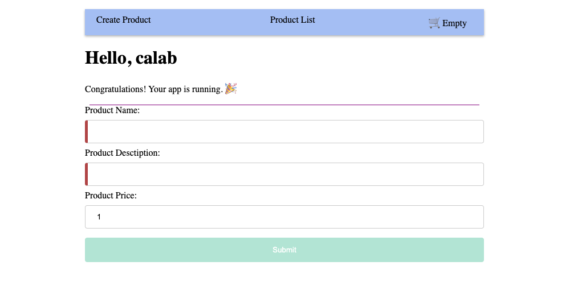
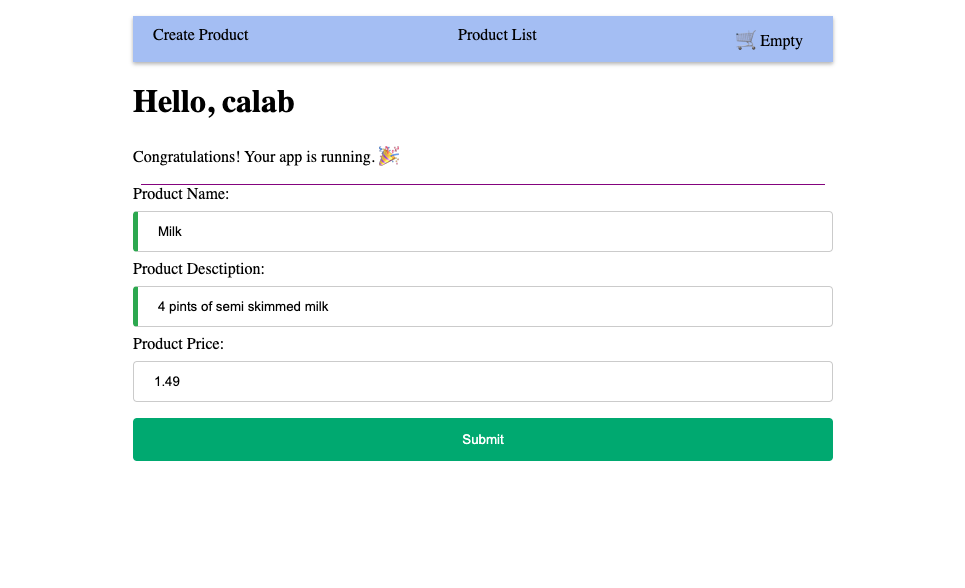

# Angular Forms Lab

## 1. Setup Project

### 1.1 Install Dependencies

1. Change directory to `calab`:

    ```.sh
    cd calab
    ```
2. Install dependencies by running the following command:

    ```.sh
    npm install
    ```
3. You should see a message in your Terminal confirming the npm packages were installed successfully:
    []() 

### 1.1 Start The Application

1. Start Angular Development Server if not yet started:

    ```.bash
    npx -p @angular/cli ng serve
    ```
    > _Otherwise refresh the browser tab to see updated view._

2. You should see the following getting rendered in your browser:

    []() 

    > _You should see similar view to where you left off in previous lab._


## Create a Template Driven Form

### Setup Template Driven Form 

- Open `src/app/components/create-product/create-product.component.ts` and do the following:
    - Import `FormsModule`:

        ```.js
        import { FormsModule } from '@angular/forms';​
        ```
    - Update imports to include FormsModule

        ```.js
        imports: [FormsModule],​
        ```

- Open `src/app/components/create-product/create-product.component.html` file and add the following form:
    
    ```.html
    <form>
        <label for="name">Product Name:</label>
        <input type="text" id="name" name="name" required>
        
        <label for="description">Product Desctiption:</label> 
        <input type="text" id="description" name="description" required>
        
        <label for="price">Product Price:</label>
        <input type="number" id="price" name="price">

        <button type="submit">Submit</button> 
    </form>
   ```

- Open `src/app/components/create-product/create-product.component.css` file and add some style:

    ```.css
    /* Style inputs */
    input, select {
        width: 100%;
        padding: 12px 20px;
        margin: 8px 0;
        display: inline-block;
        border: 1px solid #ccc;
        border-radius: 4px;
        box-sizing: border-box;
    }

    /* Style the submit button */
    button[type=submit] {
        width: 100%;
        background-color: #04AA6D;
        color: white;
        padding: 14px 20px;
        margin: 8px 0;
        border: none;
        border-radius: 4px;
        cursor: pointer;
    }
    /* Style the disabled button */
    button:disabled{
    opacity: 0.3;
    }

    /* Add a background color to the submit button on mouse-over */
    button[type=submit]:hover {
        background-color: #45a049;
    }

    .ng-valid[required], .ng-valid.required  {
        border-left: 5px solid #42A948; /* green */
    }
    .ng-invalid:not(form)  {
        border-left: 5px solid #a94442; /* red */
    }
    ```

### Data Bind With ngModel

- Open `src/app/models/product.ts` and make id optional:

    ```.js
    export class Product {
        constructor(
            public name: string,
            public description: string,
            public price: number,
            public id?: number,
        ) {}
    }
    ```

- Open `src/app/components/create-product/create-product.component.ts` and do the following:
    - Just above `constructor`, declare a product model to bind to the template:

        ```.js
        product: Product;
        ```
    - Inside `constructor` initialize Product instance

        ```.js
        this.product = new Product('', '', 1);​
        ```

- Open `src/app/components/create-product/create-product.component.html` file and add the following form:
    - Update a form template with ngModel directive to enable two-way data binding.

        ```.js
        <form>
            <label for="name">Product Name:</label>
            <input type="text" id="name" name="name" required [(ngModel)]="product.name">
            
            <label for="description">Product Desctiption:</label> 
            <input type="text" id="description" name="description" required [(ngModel)]="product.description">
            
            <label for="price">Product Price:</label>
            <input type="number" id="price" name="price" [(ngModel)]="product.price">
            
            <button type="submit">Submit</button> 
        </form>
        ```

### Submitting the Form

- Open `src/app/components/create-product/create-product.component.ts` and do the following:
    - Import and injecct ProductService into constrctor.

        ```.js
          constructor(private productService: ProductService){...}
        ```

    - Implement `onSubmit` method that would call ProductService.
        ```.js
        onSubmit(){
            console.log(this.product);
            this.productService.createProduct(this.product);
        }
        ```
    
- Open `src/app/components/create-product/create-product.component.html` and Add an ngSubmit event listener to the form tag with the onSubmit() callback method:

    ```.html
    <form (ngSubmit)="onSubmit()">
    ...
    ```

### Update ProductService

- Open `src/app/services/product.service.ts` and do the folowing:
    - Declare a list if Products and initialize it with an empty list: 

        ```.js
        products: Product[] = [];
        ```

    - Inside `constructor` assign products array a default list of values.

        ```.js
        this.products = DATA;
        ```
    - Update `getProducts()` method to return `products` list.

        ```.js
        getProducts(){
            this.logger.log('Fetching Products');
            return this.products;
        }
        ```
    
    - Create new method to append new product to the existing list:

        ```.js
        createProduct(product: Product){
            product.id = this.products.length;
            this.products.push(product);
        }
        ```
### Reroute To Product List When New Product Is Successfully Created 

- Open `src/app/components/create-product/create-product.component.ts` and do the following:
    - Import Router:

        ```.js
        import { Router } from '@angular/router';
        ```
    - Just above `constructor` create a new instance of a Router.

        ```.js
        router = new Router();
        ```
    - Update `createProduct()` method to call `router`:

        ```.js
        this.router.navigate(['/product-list']);
        ```

### Enamble Form Validation
- Open `src/app/components/create-product/create-product.component.html` and do the following:
    - Update the `<form>` tag with a template reference variable, #productForm
        
        ```.html
        <form (ngSubmit)="onSubmit()" #productForm="ngForm">
        ```
    - Add disabled property to submit `button`:

        ```.html
        <button type="submit" [disabled]="productForm.invalid" >Submit</button> 
        ```

### 3.3 Review Changes

1. Start Angular Development Server if not yet started:

    ```.bash
    npx -p @angular/cli ng serve 
    ```
    > _Otherwise refresh the browser tab to see updated view._

2. You should see the following getting rendered in your browser:
    []() 

3. Once you enter data into the form you should see button getting enabled:
    []() 

3. Once submitted you should be redirected to new Product List screen and see newly added Product at the bottom of the list
    []() 


## Replace Template Driven Form With Reactive Form

### Create Reactive Form
- Open `src/app/components/create-product/create-product.component.ts` and do the following:
    - Import `FormBuilder`, `FormGroup` and  `ReactiveFormsModule`:
        
        ```.js
        import { FormBuilder, FormGroup, ReactiveFormsModule  } from '@angular/forms';​
        ```

    - Update imports to include ReactiveFormsModule 

        ```.js
        imports: [ReactiveFormsModule],​
        ```
    
    - Just above `constructor`, declare a `productForm`:

        ```.js
        productForm: FormGroup;
        ```

    - Inject `FormBuilder` into constructor:
        ```.js
        constructor(private productService: ProductService, private formBuilder: FormBuilder){...}
        ```

    - Inside `constructor` initialize productForm instance

        ```.js
        this.productForm = this.formBuilder.group({
            name: [''],
            description: [''],
            price:[0]
        });
        ```
    - Update `onSubmit()` function to use productForm value:

        ```.js
        console.log(this.productForm.value);
        this.productService.createProduct(this.productForm.value);
        ```

- Open `src/app/components/create-product/create-product.component.html` and do the following:
    - Register productForm formGroup in the template:

        ```.html
        <form (ngSubmit)="onSubmit()" [formGroup]="productForm">
        ```
    - Associate FormGroup model with individual template elements using `formControlName` directive.

        ```.html
        <label for="name">Product Name:</label>
        <input type="text" id="name" name="name" formControlName="name">
        
        <label for="description">Product Desctiption:</label> 
        <input type="text" id="description" name="description" formControlName="description">
        
        <label for="price">Product Price:</label>
        <input type="number" id="price" name="price" formControlName="price">
        ```

### Enable Reactive Form Validation

- Open `src/app/components/create-product/create-product.component.ts` and do the following:
    - Import `Validators`:
        
        ```.js
        import { FormBuilder, FormGroup, ReactiveFormsModule, Validators  } from '@angular/forms';​
        ```
    - Add required validators to name and description form controls. Update productForm with the following:

    ```.js
    this.productForm = this.formBuilder.group({
      name: ['', [Validators.required]],
      description: ['', [Validators.required]],
      price:[0]
    });
    ```

### 3.3 Review Changes

1. Start Angular Development Server if not yet started:

    ```.bash
    npx -p @angular/cli ng serve 
    ```
    > _Otherwise refresh the browser tab to see updated view._

2. You should see the same behaviour as when using Template Driven form:
    []() 

3. Once you enter data into the form you should see button getting enabled:
    []() 

3. Once submitted you should be redirected to new Product List screen and see newly added Product at the bottom of the list
    []() 