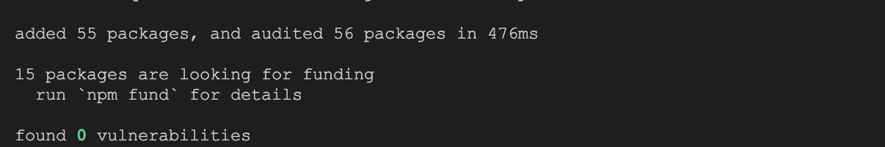
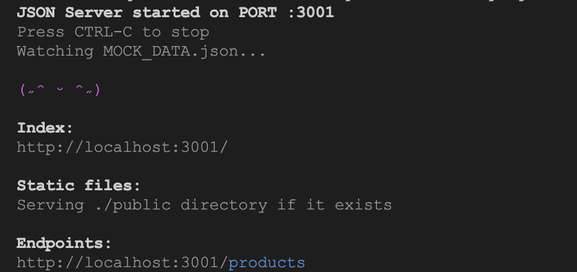
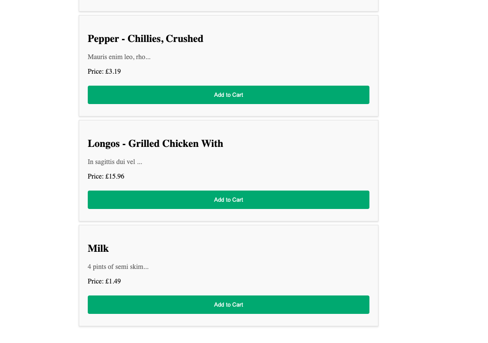
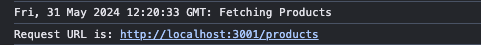

# Angular HTTP Client Lab

## 1. Setup Project

### 1.1 Install JSON Server Dependencies

1. Change directory to `json-server`:

    ```.sh
    cd json-server
    ```
2. Install dependencies by running the following command:

    ```.sh
    npm install
    ```
3. You should see a message in your Terminal confirming the npm packages were installed successfully:
    []() 

### 1.2 Start JSON Server
1. Start JSON server:

    ```.bash
    npx json-server MOCK_DATA.json -p 3001
    ```

2. You should see the following getting rendered in your browser:

    []() 

    > _You should see similar view to where you left off in previous lab._

### 1.3 Install Angular Dependencies

1. Open new terminal window.
2. Change directory to `calab`:

    ```.bash
    cd calab
    ```
3. Install dependencies by running the following command:

    ```.bash
    npm install
    ```
4. You should see a message in your Terminal confirming the npm packages were installed successfully:
    []() 

### 1.1 Start The Application

1. Start Angular Development Server if not yet started:

    ```.bash
    npx -p @angular/cli ng serve
    ```
    > _Otherwise refresh the browser tab to see updated view._

2. You should see the following getting rendered in your browser:

    []() 

    > _You should see similar view to where you left off in previous lab._


## 2. Setup HttpClient

### 2.1 Update App Configuration

1. Open `src/app/app.config.ts` file and do the following:
    - Import `provideHttpClient`:
        ```.js
        import { provideHttpClient } from '@angular/common/http';
        ```
    - Provide `provideHttpClient` helper function:

        ```.js
        export const appConfig: ApplicationConfig = {
              providers: [provideRouter(routes), provideClientHydration(), {provide: LoggerService, useClass: TimedLoggerService}, provideHttpClient() ]
        };
        ```

## 3. Configure a Service

### 3.2 Inject The HttpClient Service 

1. Open `src/app/services/product.service.ts` file and do the following:
    - Import `HttpClient`.

        ```.js
        import { HttpClient } from '@angular/common/http';

        ```

    - Inject `HttpClient` as a dependency into `ProductService` constructor.

        ```.js
        export class ProductService {
              constructor(private logger: LoggerService, private httpClient: HttpClient) { ... }
        }        
        ```

## 4. Update Product Service

### 5.1 Create a GET http request

1. Open `src/app/services/product.service.ts` file and do the following:
    - Delete list if Products variable which is declared just above constructor. 
    - Also delete it's reference from constructor. 
    
    - Update function called `getProducts` to call http get() method.

        ```.js 
        getProducts(): Observable<Product[]>{
            this.logger.log('Fetching Products');
            return this.httpClient.get<Product[]>('http://localhost:3001/products');
        }
        ```
    - Update function called `createProduct` to call http post() method.

        ```.js 
        createProduct(product: Product){
            this.httpClient.post<Product>('http://localhost:3001/products', product).subscribe(res => {​
            console.log('Product was created successfully:', res);​
            });
        }
        ```

## 4. Update Product List Component

- Open `src/app/components/product-list/product-list.component.ts` file and do the following:

    - Import `Observable` and `AsyncPipe`.

        ```.js
        import { Observable } from 'rxjs';
        import { AsyncPipe } from '@angular/common';​
        ```
    - Update imports to include AsyncPipe

        ```.js
        imports: [ProductComponent, AsyncPipe],​
        ```

    - Update product List variable to an Observable.

        ```.js
        products$!: Observable<Product[]>;
        ```
    - Make a ProductService call to get all products whjen Components is initialized:

        ```.js
        ngOnInit(): void {
            this.products$ = this.productService.getProducts();
        }
        ```

- Open `src/app/components/product-list/product-list.component.html` file and do the following:
    - Combine @If with the async pipe to render the UI for the data only after it's finished loading:
        ```.html
        @if (products$ | async; as products) {
            @for (product of products; track product) {
                <app-product [product]="product"(addToCartEvent)="addToCart($event)"></app-product>
            }
        }
        ```

### 3.3 Review Changes

1. Start Angular Development Server if not yet started:

    ```.bash
    npx -p @angular/cli ng serve 
    ```
    > _Otherwise refresh the browser tab to see updated view._

2. You should see the same behaviour as before, but this time values persist until JSON server is restarted:
    []() 

3. Once you enter data into the form you should see button getting enabled:
    []() 

3. Once submitted you should be redirected to new Product List screen and see newly added Product at the bottom of the list
    []() 


## 6. Interceptors

### 6.1 Define an Interceptor
1. Open `src/app/app.config.ts` file and do the following:

    - Import `HttpEvent`, `HttpHandlerFn`, `HttpRequest`, `withInterceptors` and `Observable`.

        ```.js
        import { HttpEvent, HttpHandlerFn, HttpRequest, provideHttpClient, withInterceptors } from '@angular/common/http';
        import { Observable } from 'rxjs';
        ```

    -  Define a `loggingInterceptor` helper function:

        ```.js
        export function loggingInterceptor(req: HttpRequest<unknown>, next: HttpHandlerFn): Observable<HttpEvent<unknown>> {
            console.log(`Request URL is: ${req.url}`);
            return next(req);
        }
        ```
    - Declare an interceptor inside `provideHttpClient` helper function:

        ```.js
        export const appConfig: ApplicationConfig = {
            providers: [provideRouter(routes), provideClientHydration(), provideHttpClient(withInterceptors([loggingInterceptor])), {provide: LoggerService, useClass: TimedLoggerService}]
        };

### 3.3 Review Changes

1. Start Angular Development Server if not yet started:

    ```.bash
    npx -p @angular/cli ng serve 
    ```
    > _Otherwise refresh the browser tab to see updated view._

2. You should see the same behaviour as before but in addition URL is getting logged
    []() 